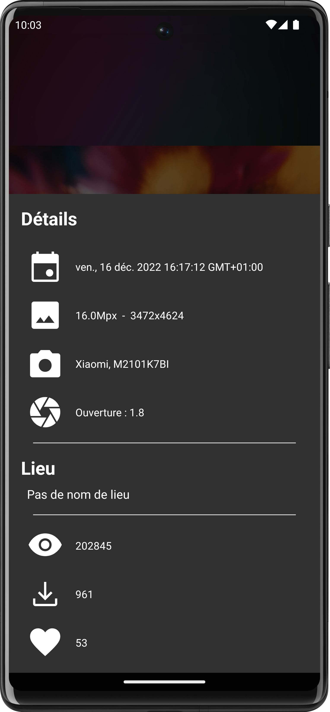

# PhotoFeed-MVVM

 

PhotoFeed-MVVM is an Android application following MVVM architecture (Coroutine + Flow + MutableLiveData + Retrofit + Room + NavGraph ) and using UnsplashApi to show a feed of pictures and detail of each in another view

## Functionalities

- [x] List all Photos of the given feed
- [x] Switch Grid Style to List Style
- [x] Show details of a selected picture
- [x] Pinch to zoom in/out
- [x] Share the picture on every app installed on the phone that can share pictures
- [x] Caching database for keeping the app working even if there's network trouble
- [x] Network error logic for preventing crash and load local database datas
- [x] Skeleton / Shimmering effect during feed loading for better UX
- [x] Shared Element between fragment so we can make sweet transitions
- [x] Local Data First Logic

## 	PhotoFeed-MVVM & Android Versions

​		PhotoFeed-MVVM is compatible with Android API 26 and target API 33.

| Tested Android API |  26  |  29  |  32  |  33  |
| :----------------- | :--: | :--: | :--: | :--: |
| **1.0.0**          |  ✔   |  ✔   |  ✔   |  ✔   |

## Screenshots

|  |  |
| :----------------------------------------------------------: | ------------------------------------------------------------ |
|  |  |

## What's next?

* Better abstraction with some interfaces 
* UI/Unit test
* Made some land xml for both fragment and fix the auto switch fragment
* Perhaps less responsibility in the PhotoFeedListFragment
* Global management of error with dedicated popup view
* Add inifinite scrolling with paging requested data

## Externals Libraries

* [Retrofit](https://github.com/square/retrofit) for API calls
* [Hilt](https://dagger.dev/hilt/) for dependency injection
* [Glide](https://github.com/bumptech/glide) for image loading / caching 
* [Toasty](https://github.com/GrenderG/Toasty) for better designing error toast
* [Zoom Layout](https://github.com/natario1/ZoomLayout) for pinch to zoom outside the determined size of view
* [Skeleton Layout](https://github.com/Faltenreich/SkeletonLayout) for shimmering effect on load

## Copying

* **Code**: you can redistribute it and/or modify
  it under the terms of the GNU General Public License ([GPLv2](https://www.gnu.org/licenses/gpl-2.0.en.html)).

